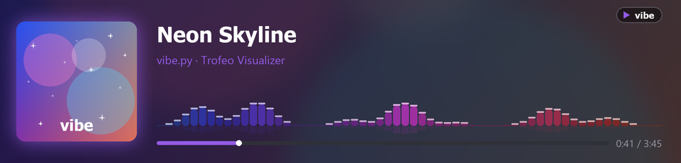
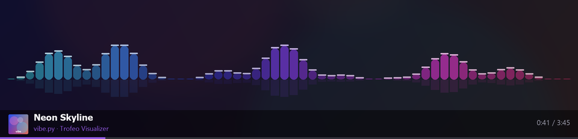
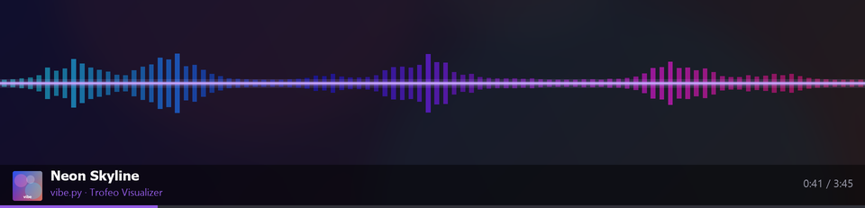
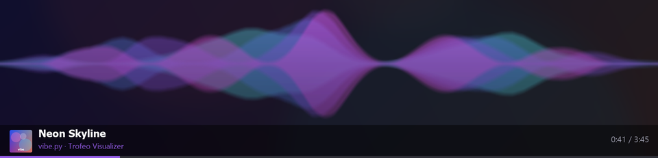
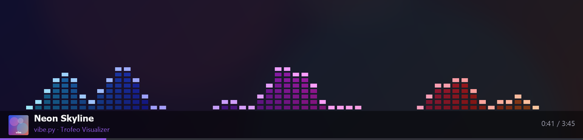
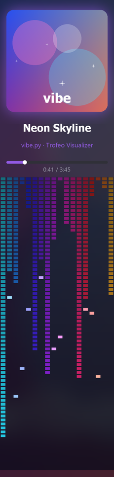
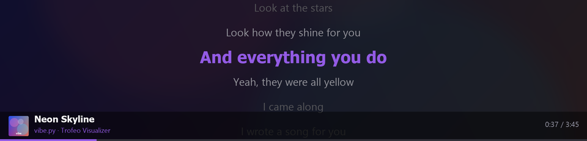

# 🎵 vibe.py — Now-Playing + Audio Visualizer

> 🍴 **Fork ของ [iTeRy-Jaturawit/thermalright-trofeo-916](https://github.com/iTeRy-Jaturawit/thermalright-trofeo-916)**
> — ใช้ไดรเวอร์จอ + โปรโตคอล **LY** ของ upstream (`trofeo.py` / `frame.py`)
> แล้วเพิ่ม **`vibe.py`** (now-playing + audio visualizer) เป็นของใหม่ในโปรเจกต์นี้

แดชบอร์ดเพลง + visualizer เรียลไทม์สำหรับจอ **Thermalright Trofeo Vision 9.16**
(จอ USB strip 1920×462) — ดึงเพลงที่เล่นอยู่จาก **Windows SMTC**
(Spotify / Apple Music / YouTube / อะไรก็ได้ที่คุม media key ได้) + วิเคราะห์เสียงจริงจาก
**WASAPI loopback** แล้ววาดเป็นเฟรมส่งขึ้นจอที่ 30fps



---

## ✨ ฟีเจอร์

- 🎧 **Now-Playing** — ปกอัลบั้ม · ชื่อเพลง/ศิลปิน (marquee เลื่อนถ้ายาว) · progress เดินลื่น
- 🌈 **Visualizer 6 สไตล์** reactive กับเสียงจริง (FFT → 60 ย่านความถี่)
- 🎨 **ธีมสีดูดจากปกอัลบั้ม** — โทนสีทั้งเฟรมเปลี่ยนตามทุกเพลง
- ✦ ปกอัลบั้ม **glow เต้นตามบีต** + **ประกายวิบวับ** (ผูกกับ kick ของเบส)
- 🕺 **ClaudePix mascot** เต้นตามบีต (`--mascot`)
- 🖥️ **แนวตั้ง / แนวนอน / เต็มจอ** — `--portrait` · `--full`
- 🎲 **โหมด random** สุ่มสลับสไตล์ทุก 8–14 วิ
- 🎤 **เนื้อเพลงคาราโอเกะ** (`--lyrics`) — ซิงค์เวลาจาก LRCLIB เลื่อนไหลนุ่ม
- 🔊 **AGC (auto-gain)** — บาร์เต็มสวยไม่ว่าเพลงดัง/เบา + noise gate กันช่วงเงียบซ่า
- ⚡ 30fps ลื่น (ปิด GC ในลูปกัน pause) — เล่นได้โดยไม่ต้องมีจอ (`--preview` / `--demo`)

---

## 🎨 สไตล์ Visualizer

ทุกสไตล์ใช้ได้ทั้ง **แนวตั้ง / แนวนอน / เต็มจอ** และไล่สีตามปกอัลบั้ม

### `classic` — แท่งสเปกตรัม + เงาสะท้อนกระจก


### `bars` — waveform เส้นมิเรอร์รอบเส้นกลางเรืองแสง


### `ribbon` — คลื่นริบบิ้นโปร่งแสงซ้อนกัน


### `dots` — LED matrix (มีโหมด `--invert` แท่งห้อยจากบน + พีคร่วงตามแรงโน้มถ่วง)


### แนวตั้ง — `wave` (particle cloud) · `dots --invert` (พีคร่วงเป็นสายหยด)

 &nbsp; 

> ยังมี `wave` = particle ไหลลื่น (คลาวด์จุดนีออน) ด้วย

---

## 🎤 เนื้อเพลงคาราโอเกะ (`--lyrics`)

ดึงเนื้อเพลง**ซิงค์เวลา**จาก [LRCLIB](https://lrclib.net) (ฟรี ไม่ต้อง key) ตามเพลงที่เล่นอยู่
บรรทัดที่ร้องอยู่เด่น (accent) ตรงกลาง บรรทัดข้างจางลง **เลื่อนไหลนุ่ม** ตามจังหวะ



> เพลงเมนสตรีมเจอเกือบหมด · เพลงไม่ดัง/บางภาษาอาจไม่มี → โชว์ visualizer แทน

---

## 🚀 ติดตั้ง

```bash
pip install -r requirements.txt          # ฝั่งจอ: pyusb + pillow (มี libusb-1.0.dll แถมมาแล้ว)
pip install soundcard winsdk numpy       # สำหรับ vibe.py (Windows เท่านั้น)
```

ต่อจอผ่าน USB — จอ Trofeo มี MS OS descriptor → Windows โหลด **WinUSB** ให้อัตโนมัติ
(ไม่ต้องลง Zadig)

---

## ⌨️ วิธีใช้

```bash
python vibe.py                       # แนวนอน now-playing + สเปกตรัมคลาสสิก (มีเงาสะท้อน)
python vibe.py --viz random          # สุ่มสลับ 6 สไตล์
python vibe.py --full --viz bars     # waveform เต็มจอ 1920×462
python vibe.py --portrait --viz ribbon   # แนวตั้ง (mount จอตั้ง)
python vibe.py --portrait --viz dots --invert   # LED matrix กลับหัว พีคร่วง
python vibe.py --full --lyrics       # เนื้อเพลงคาราโอเกะเต็มจอ (ซิงค์เวลา)
python vibe.py --mascot              # ClaudePix เต้นตามบีตแทนปก
python vibe.py --preview out.png     # เรนเดอร์ 1 เฟรมเป็นรูป (ไม่ต้องต่อจอ)
```

| flag | ทำอะไร |
|------|--------|
| `--viz {wave,dots,bars,ribbon,classic,random}` | เลือกสไตล์ visualizer |
| `--portrait` / `--flip` | แนวตั้ง 462×1920 / พลิกด้าน |
| `--full` | (แนวนอน) viz เต็มจอ + แถบ now-playing เล็กล่าง |
| `--lyrics` | โหมดเนื้อเพลงคาราโอเกะ (ซิงค์เวลาจาก LRCLIB) |
| `--invert` | สเปกตรัม dots กลับหัว (พีคร่วงตามแรงโน้มถ่วง) |
| `--mascot` | โชว์ ClaudePix เต้นตามบีต |
| `--no-sparkle` / `--no-glow` | ปิดประกาย / ปิด glow ขอบปก |
| `--gain N` / `--no-agc` | ปรับความไวเสียง (บน AGC) / ปิด auto-gain ใช้ค่าตายตัว |
| `--demo` | เพลง/สเปกตรัมจำลอง (ไม่แตะ media/เสียง) |
| `--fps N` · `--quality 1-95` | ปรับ fps / คุณภาพ JPEG |

---

## 🖥️ แอป Windows (System Tray)

รันเป็นแอปมีไอคอนมุมจอ — เลือกโหมดจากเมนู ไม่ต้องพิมพ์ CLI

```
pip install pystray
python vibe_tray.py
```

ไอคอน **waveform** โผล่ใน system tray → **คลิกขวา** เลือกได้สด (เปลี่ยนปุ๊บจอเปลี่ยนปั๊บ):
- **แนว** — แนวนอน / แนวนอนเต็มจอ / แนวตั้ง
- **Visualizer** — classic / dots / bars / ribbon / wave / random
- **เนื้อเพลง · ClaudePix · dots กลับหัว** — เปิด/ปิด
- **ออก**

### แพ็กเป็น .exe (ไม่ต้องมี Python)

```
pip install pyinstaller
build_exe.bat            # → dist\vibe\vibe.exe (ดับเบิลคลิกรัน)
```

> ใช้ **`--onedir`** (แจกทั้งโฟลเดอร์ `dist\vibe\`) — เชื่อถือได้กว่า `--onefile`
> ที่มักโดน Windows Defender ล็อกไฟล์ตอน self-extract

---

## 🛠️ สถาปัตยกรรม

```
SMTC (winsdk) ─┐                         ┌─ trofeo.py  (USB bulk / โปรโตคอล LY)
               ├─→ vibe.py (วาดเฟรม PIL) ─┤
loopback ──────┘   ธีมสี · visualizer     └─ ส่ง JPEG ขึ้นจอ 30fps
(soundcard→FFT)
```

- `trofeo.py` — คุมจอผ่าน USB (โปรโตคอล LY)
- `frame.py` — compose / rotate / overlay
- `vibe.py` — now-playing + visualizer (ไฟล์นี้)

---

## 🙏 เครดิต

`vibe.py` + visualizer ทั้งหมดสร้างบนไดรเวอร์จอ + โปรโตคอล **LY** ของ
[**thermalright-trofeo-916**](https://github.com/iTeRy-Jaturawit/thermalright-trofeo-916)
โดย **iTeRy-Jaturawit** (`trofeo.py` / `frame.py` / `send.py` / `clock.py` / `claw.py`)

📄 รายละเอียดโปรโตคอล LY, ตาราง KX87 vs Trofeo, สเปกฮาร์ดแวร์ → ดู **[PROTOCOL.md](PROTOCOL.md)** (README เดิมของ upstream)
